### **🔥  Comparison Table: All CSS Color Formats**  

| **Color Format** | **Why Introduced?** | **Best For?** | **Used In?** | **Cons** |
|------------------|-------------------|-------------|-------------|---------|
| **Hex (`#RRGGBB`)** | Compact, web-safe, widely supported | Solid colors, branding | Web design, UI components | No alpha transparency, less human-readable |
| **Hex (`#RGB`)** | Shorthand for quick use | Simple UI, quick styling | Quick prototyping, small projects | Less precise (fewer colors) |
| **RGB (`rgb(r, g, b)`)** | More readable, better control | Dynamic colors, JavaScript manipulation | UI elements, animations | Longer than hex |
| **RGBA (`rgba(r, g, b, a)`)** | Adds transparency control | Overlays, glass effects | Modals, pop-ups, shadows | Same as RGB but longer |
| **HSL (`hsl(hue, saturation, lightness)`)** | More intuitive for designers | Theming, branding | CSS frameworks, color adjustments | Slight learning curve |
| **HSLA (`hsla(h, s, l, a)`)** | Adds alpha transparency to HSL | Transparent themes, UI highlights | Gradients, UI components | Not commonly used compared to RGBA |
| **HWB (`hwb(hue, whiteness, blackness)`)** | Easier color mixing with white/black | Soft UI, backgrounds | Theming, CSS frameworks | Not as widely used as `hsl()` |
| **Lab (`lab(l a b)`)** | Perceptually uniform color spacing | Accessibility, high contrast | Accessible web design, color grading | Complex, not widely supported |
| **LCH (`lch(l c h)`)** | More natural-looking color gradients | Print design, accessibility | UI contrast improvements, modern web | Not supported in all browsers |
| **OKLab (`oklab(l a b)`)** | More accurate contrast & human perception | UI contrast, accessibility | Dark mode, text readability | Not fully supported in all browsers |
| **OKLCH (`oklch(l c h)`)** | Improved `LCH`, better human eye contrast | High contrast UI, branding | Accessible design, modern web | Limited browser support |
| **Named Colors (`red`, `blue`, `crimson`)** | Human-readable, easy to use | Quick color application | Basic UI, simple elements | Limited set of colors |

### **🚀 Key Takeaways**
✔ **For precision & control** → Use `RGB`, `HSL`, or `Lab`.  
✔ **For quick, readable colors** → Use `Hex` or `Named Colors`.  
✔ **For transparency & overlays** → Use `RGBA` or `HSLA`.  
✔ **For accessibility & best contrast** → `LCH`, `OKLab`, or `OKLCH` are best.  
✔ **For soft UI & themes** → `HWB` is a good choice. 

**E.g 'A' in RGBA is Alpha chanel whose value is from 0-1(0 - means hidden) , which handles opacity .  In HEX if we want to describe alpha value(range from 00-ff) #4dff11a1 , here a1 denoted alpha value**

Note : Hex is from Hexadecimal number system that includes 0-9 , A, B,C,D,E,F i.e 00-FF in Hex. In RGB(Red, Green ,Blue) its 0-255 . In HEX , first two places represent how much red , next two Green and last two Blue

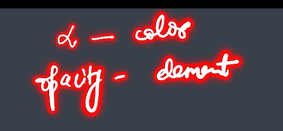

alpha - opacity of color
opacity property - opacity of element
---

### **🔥  `text-align` in CSS**  

The `text-align` property controls **horizontal alignment** of the content. It is RELATIVE to PARENT and is not absolute i.e centre will be on basis of the parent element width and not the screen.  Here’s **everything** you need to know about it.

| **Value** | **Effect** | **Best Use Case** |
|-----------|-----------|----------------|
| `left` | Aligns text to the **left** | Default for LTR (English, French) |
| `right` | Aligns text to the **right** | Default for RTL (Arabic, Hebrew) |
| `center` | Centers the text | Headings, banners, modals |
| `justify` | Stretches text for full-width alignment but can cause space issues | Articles, newspapers, books |
| `start` | Aligns **left in LTR** and **right in RTL** | Multilingual websites |
| `end` | Aligns **right in LTR** and **left in RTL** | Multilingual websites |

❌ `text-align` does NOT apply to:  
- **Flexbox/Grid items** 
- **Absolutely positioned elements** 
- **Block-level elements like `<div>`** as it aligns the **inline** content inside the block & for inline `span` or `<a>` it inherets from block container.

---

### **🔥`text-decoration` in CSS**  

The `text-decoration` property in CSS is used to **apply and control text decorations** like underlines, overlines, line-throughs (strikethroughs).  


```css
text-decoration: <line> <style> <color> <thickness>;
```
✅ The shorthand consists of:  
- **`line`** → What kind of decoration (`underline`, `overline`, `line-through`, `none`)  
- **`style`** → The style of the line (`solid`, `dashed`, `double`, etc.)  
- **`color`** → The color of the line  


🔹 **Example:**  
```css
p {
  text-decoration: underline dashed red 3px;
}
```
✅ **This is equivalent to:**  
```css
p {
  text-decoration-line: underline;
  text-decoration-style: dashed;
  text-decoration-color: red;
  text-decoration-thickness: 3px;
}
```

## **Summary Table**
| **Property** | **Effect** | **Example** |
|-------------|-----------|-------------|
| `text-decoration-line` | What decoration to apply (`underline`, `overline`, `line-through`) | `underline overline` |
| `text-decoration-style` | How the decoration looks (`solid`, `dotted`, `wavy`) | `wavy` |
| `text-decoration-color` | Color of the decoration line | `red` |
| `text-decoration-thickness` | Controls the thickness of the decoration | `3px` |
| `text-underline-offset` | Moves the UNDERLINE up/down | `5px` |
| `text-decoration` (shorthand) | Combines all properties | `underline dashed blue 2px` |

---


### **🔥`line-height` in CSS**
The `line-height` property controls **the vertical spacing between lines of text**. It is **crucial for readability, accessibility, and design aesthetics**.

---

## **📌 1. `line-height` Syntax & Values**  
```css
line-height: <value>;
```
✅ The `<value>` can be:  
| **Type** | **Example** | **Effect** |
|------------|-------------|------------|
| **Unitless number** | `line-height: 1.5;` | Multiplies the font size (Best Practice ✅) i.e. 1.5 * normal |
| **Pixels (`px`)** | `line-height: 24px;` | Fixed line spacing (Not flexible ❌) |
| **Percentage (`%`)** | `line-height: 150%;` | 150% of font size |
| **Relative Units (`em`, `rem`)** | `line-height: 1.2em;` | Based on element’s font size |
| **Normal (default)** | `line-height: normal;` | Browser-defined spacing (~1.2 - 1.4x font size) |


---

## **🔥 `letter-spacing` in CSS**  

The `letter-spacing` property controls **the space between characters** in text. It **affects readability, aesthetics, and design layout.**  


```css
letter-spacing: <value>;
```
✅ **Values can be:**  
| **Value Type** | **Example** | **Effect** |
|------------|-------------|------------|
| **Normal (default)** | `letter-spacing: normal;` | Browser-defined spacing |
| **Positive length** | `letter-spacing: 2px;` | Increases space between letters |
| **Negative length** | `letter-spacing: -1px;` | Reduces space between letters |

 

### **Example: Fixing Kerning Issues**
Some fonts may look **too tight or too loose**. You can manually adjust:

```css
p {
  font-family: Arial, sans-serif;
  letter-spacing: 0.5px;
}
```


## **`letter-spacing` & `word-spacing` (Difference)**
| **Property** | **What It Controls?** | **Example** |
|-------------|----------------------|-------------|
| `letter-spacing` | Space **between individual letters** | `letter-spacing: 2px;` |
| `word-spacing` | Space **between words** | `word-spacing: 5px;` |

🔹 **Example:**
```css
p {
  letter-spacing: 2px;
  word-spacing: 5px;
}
```
✅ **Both properties can be used together** for better typography.


# **🔥`font-size` in CSS**

 

The `font-size` property controls **the size of text** and affects readability, accessibility, and layout design.  

Note : 96px = 1 in
```css
font-size: <value>;
```
✅ **Possible values:**  
| **Value Type** | **Example** | **Effect** |
|--------------|-------------|------------|
| **Absolute Size** | `font-size: medium;` | Predefined values (`small`, `large`, etc.) |
| **Pixels (`px`)** | `font-size: 16px;` | Fixed size, does not scale |
| **Relative (`%`)** | `font-size: 120%;` | 120% of the parent’s font size |
| **`em` (Relative to Parent)** | `font-size: 1.5em;` | 1.5 times parent element’s font size |
| **`rem` (Relative to Root)** | `font-size: 2rem;` | 2 times the root (`html`) font size |
| **Viewport Units (`vw`, `vh`)** | `font-size: 5vw;` | 5% of viewport width |


✅Use `%` or `em` for mobile-first design 


# **🔥  `font-family` in CSS**  

The `font-family` property controls **which font is used** to render text on a webpage. It helps define the visual identity and readability of a website.


```css
font-family: "Font Name", fallback-font, generic-family;
```
✅ **Always use a fallback font** in case the primary font isn’t available.

🔹 **Example:**
```css
p {
  font-family: "Arial", sans-serif;
}
```
✔ If `"Arial"` is unavailable, the browser **falls back to** the `sans-serif` system font.


✔ You can **load custom fonts** using `@font-face`.

🔹 **Example:**
```css
@font-face {
  font-family: "MyCustomFont";
  src: url("my-font.woff2") format("woff2"),
       url("my-font.woff") format("woff");
}

p {
  font-family: "MyCustomFont", sans-serif;
}
```
✅ **Use `woff2` for better compression & performance.**  


✔ Modern CSS supports **system UI fonts**, which match the OS.

🔹 **Example:**
```css
p {
  font-family: system-ui;
}
```
 Uses **native fonts** like `"San Francisco"` (Mac), `"Segoe UI"` (Windows), `"Roboto"` (Android).

✔ You can **import fonts from Google Fonts**.

🔹 **Example:**
```css
@import url('https://fonts.googleapis.com/css2?family=Poppins:wght@400;700&display=swap');

p {
  font-family: "Poppins", sans-serif;
}
```

✔ **Use multiple fallbacks** (`"Roboto", Arial, sans-serif`).  
✔ **Avoid too many fonts** (slows page load).  
✔ **Use `woff2` for custom fonts** (better compression).  
✔ **Use system fonts (`system-ui`)** for faster loading.  

### **🔥 Complete Guide to `font-weight` in CSS**  

The `font-weight` property controls **how bold or light the text appears**. It affects readability, emphasis, and design aesthetics.


```css
font-weight: <value>;
```
✅ **Possible values:**  
| **Value** | **Effect** | **Numeric Equivalent** |
|-----------|-----------|-----------------------|
| `normal` | Default weight | `400` |
| `bold` | Bolder than normal | `700` |
| `bolder` | Increases weight relative to parent | **Depends on parent** |
| `lighter` | Decreases weight relative to parent | **Depends on parent** |
| `100 - 900` | Fine control over weight | `100` (thin) to `900` (extra bold) |


## **When Fonts Don’t Support All Weights**
Not all fonts have **thin (100) or extra bold (900)**. If a weight **isn’t available**, the browser **picks the closest match**.

🔹 **Example:**  
- `Arial` **supports only `400` and `700`**.
- `Roboto` **supports `100` to `900`**.


### **🚀 Final Thoughts**
✔ **Use numeric values (`100-900`) for precise weight control.**  
✔ **Use `bolder/lighter` for inheritance-based designs.**  
✔ **Check if a font supports different weights before using them.**  

### **🔥 CSS Selectors & Combinators – Quick Reference**  

CSS **selectors** target HTML elements, and **combinators** define relationships between elements.


## **Types of CSS Selectors**  

| **Selector** | **Syntax** | **Example** | **Effect** |
|-------------|------------|------------|------------|
| **Universal** | `*` | `* { margin: 0; }` | Selects all elements |
| **Type (Tag)** | `element` | `p { color: red; }` | Selects all `<p>` elements |
| **Class** | `.class` | `.title { font-size: 20px; }` | Selects elements with a specific class |
| **ID** | `#id` | `#main { background: blue; }` | Selects an element with a specific ID |
| **Attribute** | `[attr]` | `[type="text"] { border: 1px solid; }` | Selects elements with an attribute |
| **Pseudo-class** | `:pseudo-class` | `a:hover { color: red; }` | Targets elements in a specific STATE |
| **Pseudo-element** | `::pseudo-element` | `p::first-letter { font-size: 2em; }` | Styles PARTS of an element (e.g., first letter) |

---

## ** CSS Combinators (For Element Relationships)**  

| **Combinator** | **Syntax** | **Example** | **Effect** |
|---------------|------------|------------|------------|
| **Descendant** | `A B` | `div p { color: blue; }` | Selects `<p>` inside `<div>` (any level deep) |
| **Child (`>`)** | `A > B` | `div > p { color: red; }` | Selects direct children only |
| **Adjacent Sibling (`+`)** | `A + B` | `h1 + p { color: green; }` | Selects **first** `<p>` right after `<h1>` |
| **General Sibling (`~`)** | `A ~ B` | `h1 ~ p { color: gray; }` | Selects all `<p>` siblings after `<h1>` |

---

### **🚀 Final Thoughts**
✔ **Use selectors wisely** to improve performance and specificity.  
✔ **Use combinators** for structured styling and **better control** over nested elements.  

# **🔥 CSS Cascading, Specificity, and Inheritance – Complete Guide**  

Understanding **Cascading, Specificity, and Inheritance** is **crucial** for mastering CSS and resolving styling conflicts.

---

## **📌 1. What is Cascading?**  
**Cascading** refers to **how CSS rules are applied when multiple rules target the same element**. The browser follows a **priority order** to determine which rule wins.

### **🔹 Cascading Priority Order (From Highest to Lowest)**
1️⃣ **Inline styles** (`style="color: red;"`) → **Highest priority**  
2️⃣ **IDs** (`#id { color: blue; }`)  
3️⃣ **Classes, attributes, pseudo-classes** (`.class { color: green; }`)  
4️⃣ **Elements (Tags)** (`p { color: black; }`)  
5️⃣ **Universal selector (`*`)** and **inherited styles**  
6️⃣ **Browser default styles** (Lowest priority)  

✔ **If two rules have the same specificity, the last one in the CSS file wins.**  

🔹 **Example:**
```css
p { color: black; }       /* 4th priority */
#main { color: blue; }    /* 2nd priority */
.highlight { color: green; } /* 3rd priority */
p.style { color: red; }   /* 3rd priority */
```
✅ The **ID selector** (`#main`) will **override** all class or element styles.

---

## **📌 2. What is Specificity?**  
**Specificity determines which CSS rule takes precedence over others when styles conflict.**  

### **🔹 Specificity Calculation Formula**
| **Selector Type** | **Points Given** | **Example** | **Specificity Value** |
|------------------|----------------|------------|-------------------|
| **Inline Styles** | `1000` | `<p style="color: red;">` | `1000` |
| **ID (`#id`)** | `100` | `#main { color: blue; }` | `100` |
| **Class (`.class`), Attributes, Pseudo-classes** | `10` | `.highlight { color: green; }` | `10` |
| **Element (Tag)** | `1` | `p { color: black; }` | `1` |
| **Universal (`*`)** | `0` | `* { color: gray; }` | `0` |

✔ **Higher specificity wins in conflicts.**  
✔ **If specificity is equal, the last declared rule wins.**  

🔹 **Example:**  
```css
p { color: black; }      /* Specificity: 1 */
#main { color: blue; }   /* Specificity: 100 */
.highlight { color: green; } /* Specificity: 10 */
p.style { color: red; }  /* Specificity: 10 */
```
✅ **The ID (`#main`) rule wins** because **100 > 10 > 1**.

---

## **📌 3. What is Inheritance?**  
Inheritance allows **some CSS properties to be automatically passed from parent elements to child elements**.

### **🔹 Inherited Properties**
✔ **Text-based properties** are **inherited** by default:
- `color`
- `font-size`
- `letter-spacing`
- `visibility`

**Input/Buttons - DO not inherit by default , need to use inherit property**

✔ **Box model properties** **are NOT inherited**:
- `margin`
- `padding`
- `border`
- `width`, `height`

The background-color is not inherited but the background is visible for the child as well , this is because the child's background-color is transparent and hence we find the background-color of the parent for child as well.

🔹 **Example:**
```css
body {
  color: blue;  /* All text inside body will be blue */
}
p {
  font-size: inherit;  /* Explicitly inherit */
}
```
✅ The `<p>` will **inherit `color: blue;` from `<body>`**.

---

## **`!important` – Overriding Everything**
The `!important` rule **forces a style to override all other rules**, even those with higher specificity.

🔹 **Example:**
```css
p {
  color: red !important;
}
```
✔ **Even inline styles won’t override this rule!**  
❌ **Avoid excessive use** as it makes debugging difficult.

---

## **🔥 Final Summary Table**
| **Concept** | **What It Does?** | **Best Use Case** |
|-------------|------------------|------------------|
| **Cascading** | Determines which rule is applied | When multiple rules target the same element |
| **Specificity** | Assigns weight to different selectors | Resolving conflicts between different rules |
| **Inheritance** | Passes styles from parent to child | Text-based properties (color, font-size) |
| **`!important`** | Overrides all other styles | **Use sparingly** for critical overrides |

---

### **🚀 Final Thoughts**
✔ **Understand cascading to avoid unexpected styling issues.**  
✔ **Use specificity wisely; avoid using too many ID selectors.**  
✔ **Leverage inheritance to simplify CSS and reduce redundancy.**  

Your notes outline the **CSS Box Model**, which defines how elements are structured in terms of **content, padding, border, and margin**. Here’s a structured breakdown of your notes with corrections and explanations:

---

### **CSS Box Model Overview**
Every HTML element is a rectangular box consisting of:
1. **Content** – The actual text or image inside the element.
2. **Padding** – Space between the content and the border.
3. **Border** – A visible outline around the padding and content.
4. **Margin** – The space outside the border, separating elements.

---

### **Key Concepts from Your Notes:**
#### **1. Height & Content Area**
- **Height applies to the content area**, not the entire element.
- If you set `height: 100px`, it refers only to the **content area**, excluding padding, border, and margin.

#### **2. Border**
- **Defines the outermost edge** of an element.
- Properties:
  - `border-width`: Thickness (e.g., `2px`)
  - `border-style`: Type (e.g., `solid`, `dashed`)
  - `border-color`: Color (e.g., `black`)

- **Individual borders can be styled separately**:
  ```css
  border-top: 2px solid red;
  border-right: 2px dashed blue;
  border-bottom: 4px double green;
  border-left: 1px dotted black;
  <!-- For all sides -->
  border: 2px dolid black ; 
  ```

#### **3. Border Radius**
- **Used for rounded corners**.
- Example:
  ```css
  border-radius: 10px;
  ```
- You can set different radii for each corner:
  ```css
  border-top-right-radius: 15px;
  border-bottom-left-radius: 5px;
  ```

#### **4. Padding vs. Margin**
- **Padding:** Space between the content and the border.
- **Margin:** Space between the element’s border and neighboring elements.

✅ **Example:**
```css
box {
    padding: 10px;  /* Adds space inside the box */
    margin: 20px;   /* Adds space outside the box */
}
```

#### **5. Block Elements & Full Width**
- **Block elements** (like `<div>`, `<p>`, `<ul>`) **take up the full width** by default.
- **Inline elements** (like `<span>`, `<a>`) only take up as much space as their content.

✅ **Example of Block & Inline:**
```css
div {
    display: block; /* Full width */
}

span {
    display: inline; /* Only takes up content width */
}
```

---

### **Final Summary:**
- The **box model** includes **content, padding, border, and margin**.
- `height` applies only to **content**, not padding/border/margin.
- `border` defines the **outer edge** of an element.
- `padding` controls **inner spacing**, while `margin` controls **outer spacing**.
- **Block elements take full width**, while inline elements only take necessary space.

Your notes are covering the **CSS `display` property**, which controls how elements behave in a webpage. Here’s a structured explanation:

---

### **CSS `display` Property**
The `display` property defines how an element is rendered in the document flow.

#### **1️⃣ `display: block;`**
✅ Takes full width of its parent.  
✅ Starts on a new line.  
✅ Allows `width`, `height`, `margin`, and `padding`.  
📌 **Example:** `<div>`, `<p>`, `<h1>`  
```css
div {
    display: block;
    width: 300px;
    height: 100px;
    background: lightblue;
}
```

---

#### **2️⃣ `display: inline;`**
✅ Takes only as much width as its content.  
✅ Stays in the same line as other elements.  
❌ Cannot set `width` or `height` (ignored).  
📌 **Example:** `<span>`, `<a>`, `<strong>`  
```css
span {
    display: inline;
    background: yellow;
}
```

---

#### **3️⃣ `display: inline-block;`**
✅ Behaves like an `inline` element (stays in the same line).  
✅ Allows setting `width`, `height`, `margin`, `padding`.  
📌 **Example:** `<button>`, ``  
```css
button {
    display: inline-block;
    width: 150px;
    height: 50px;
    background: lightcoral;
}
```
**📌 Difference from `inline`:**  
- Inline elements **cannot** have width/height.  
- Inline-block elements **can** have width/height.

---

#### **4️⃣ `display: none;`**
✅ Completely removes the element from the page layout (as if it doesn’t exist).  
📌 **Example:** Hiding an element:
```css
.hidden {
    display: none;
}
```

---

### **🔹 Summary**
| `display` Type   | Width & Height? | Starts on New Line? | Example Tags |
|------------------|---------------|------------------|--------------|
| `block`         | ✅ Yes        | ✅ Yes           | `<div>`, `<p>` |
| `inline`        | ❌ No         | ❌ No            | `<span>`, `<a>` |
| `inline-block`  | ✅ Yes        | ❌ No            | `<button>`, `` |
| `none`          | ❌ Hidden     | ❌ Removed       | Hidden Elements |

### **CSS Units: `em`, `rem`, `vw`, `vh`, and `%`**
These units are used in **font-size, padding, margins, widths, and heights**, making layouts **responsive and scalable**. Let's break down each unit and where to use them effectively.

---

## **1️⃣ `em` (Relative to Parent)**
- `1em` = **current element’s font size** (or parent’s font size if applied to children).
- Used for **scalable font sizes, padding, margins**.
- Can **cause a snowballing effect** if nested.

### **Example: `em` in Font-Size**
```css
html { font-size: 16px; }  /* Root font size */

.parent {
    font-size: 20px;
}

.child {
    font-size: 2em;  /* 2 × parent’s 20px = 40px */
}
```
- The child’s font size becomes **40px** because `2em` multiplies the parent's `20px`.

#### **🔥 `em` Snowballing Effect**
If multiple levels of elements use `em`, font sizes can **increase exponentially**:
```css
html { font-size: 16px; }

.parent { font-size: 1.5em; }  /* 1.5 × 16px = 24px */
.child { font-size: 1.5em; }   /* 1.5 × 24px = 36px */
```
📌 **This can get out of control, so avoid using `em` for deep nested elements.**

When you set padding: 1em;, it means that the padding size is equal to the current font size of the element.


### **Best Use Cases for `em`**
✅ Padding & margins (because they scale with the  font size of itself).  
✅ Icons & buttons that need to scale with text.  
❌ Avoid using it for font-size in deep nested elements.

---

## **2️⃣ `rem` (Relative to Root)**
- `1rem` = **font size of `<html>` (root)**.
- **Consistent scaling** across the entire document.
- Unlike `em`, `rem` **does not snowball**.

### **Example: `rem` in Font-Size**
```css
html { font-size: 16px; }

.parent {
    font-size: 2rem; /* 2 × 16px = 32px */
}
```
- **Always calculated from `<html>`**, so no nesting issues.

### **Best Use Cases for `rem`**
✅ **Font sizes** (avoids snowballing).  
✅ Layout elements that should scale proportionally.  
✅ Consistent spacing across the website.  
❌ Avoid for elements that should adjust based on their parent.

---

## **3️⃣ `vw` (Viewport Width)**
- `1vw` = **1% of the viewport’s width**.
- **Useful for full-screen layouts**.

### **Example: `vw` for Responsive Text**
```css
h1 {
    font-size: 5vw; /* 5% of screen width */
}
```
- On a **1000px wide** screen, text is **50px**.
- On a **500px wide** screen, text is **25px**.

### **Best Use Cases for `vw`**
✅ Hero section fonts that scale with screen size.  
✅ Full-width layouts (e.g., background images).  
❌ Avoid for precise control over font sizes.

---

## **4️⃣ `vh` (Viewport Height)**
- `1vh` = **1% of the viewport’s height**.
- **Great for full-screen sections**.

### **Example: `vh` for Fullscreen Sections**
```css
.fullscreen {
    height: 100vh; /* 100% of viewport height */
}
```
- The element always takes **full height**, even if resized.

### **Best Use Cases for `vh`**
✅ Full-page modals.  
✅ Sections that always take full screen height.  
❌ Avoid when content needs to flow naturally.

---

## **5️⃣ `%` (Relative to Parent)**
- `width: 50%` means **half of the parent element’s width**.
- **Flexible and fluid**.

### **Example: `%` for Responsive Layouts**
```css
.container {
    width: 80%; /* 80% of parent */
    padding: 5%;
}
```
- Adapts when the parent’s width changes.

### **Best Use Cases for `%`**
✅ Fluid layouts (grids, flexbox).  
✅ Padding & margins that adjust with the container.  
❌ Avoid for font-size (use `em` or `rem` instead).

---

### **🚀 When to Use What?**
| Unit  | Best For | Avoid When |
|-------|---------|-----------|
| `em` | Padding, margins, scalable components | Nested font sizes (snowballing effect) |
| `rem` | Font sizes (global consistency) | Components that should scale with parent |
| `vw` | Viewport-based font sizes, full-width elements | Small elements that shouldn’t scale with screen width |
| `vh` | Full-page sections, hero banners | Containers with a lot of content (causes overflow) |
| `%` | Flexible layouts, grid systems | Font sizes (use `rem` instead) |


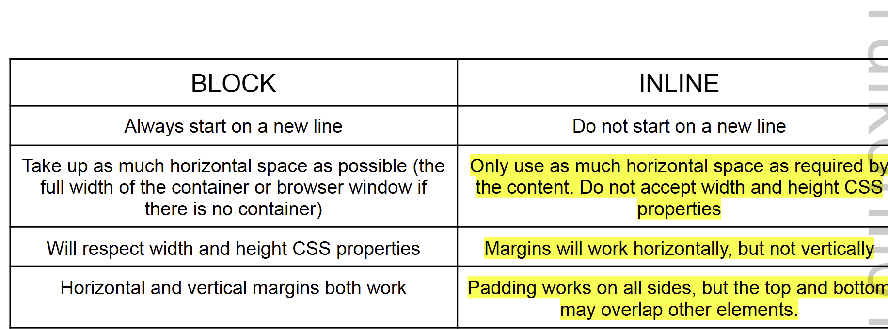

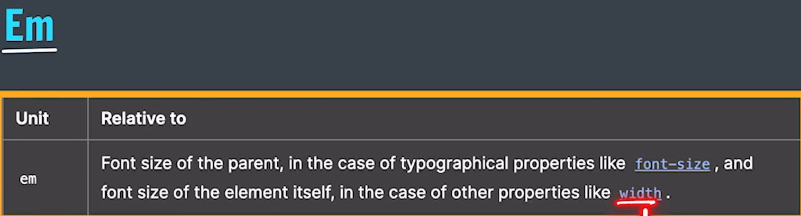

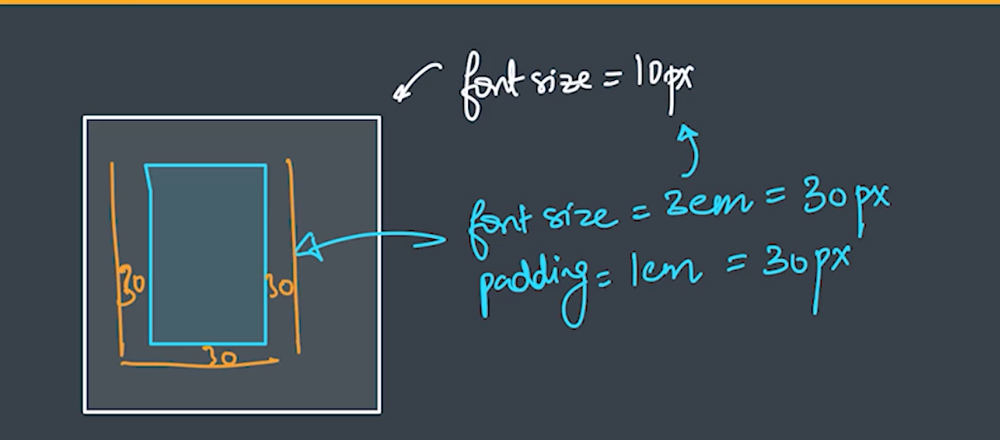

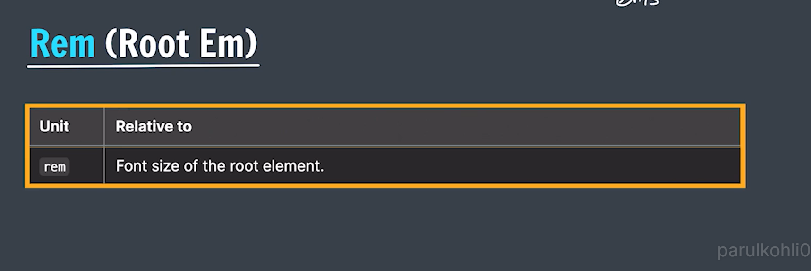
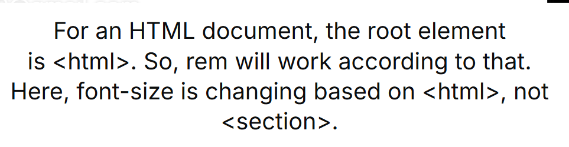


**CSS Transitions**
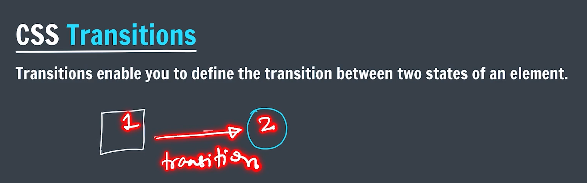


**CSS Transform**
It is applied on all the content as well inside the element
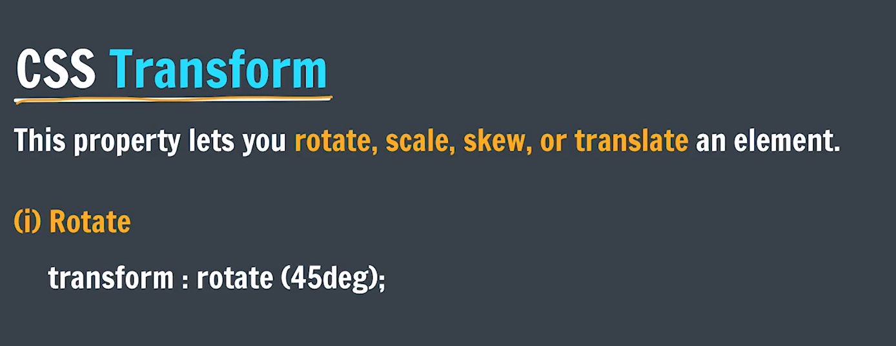

We can scale(increase in size):
```
transform: scale(0.5,1);
transform: scaleX(0.5);
transform: scaleY(1);
```
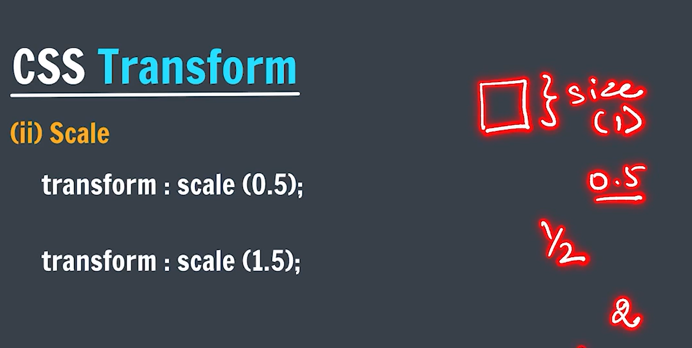

To move the element in 2D
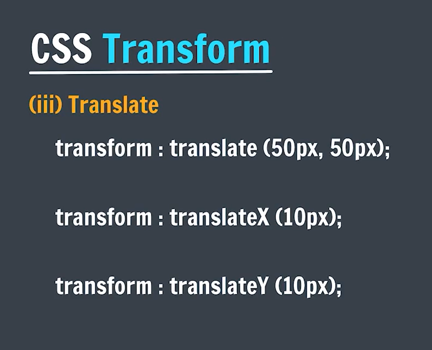


In Skew - meaning stretch to an angle and in case we make it 90 , it tends to come to a point and hence not visible
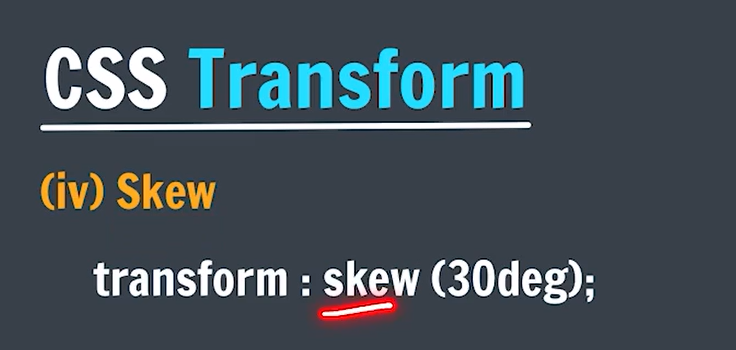
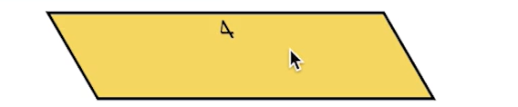
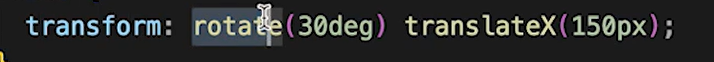


**Box Shadow**

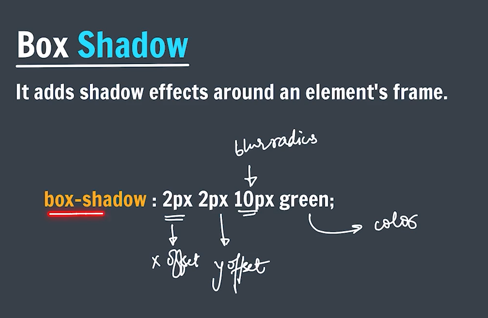


**Background**

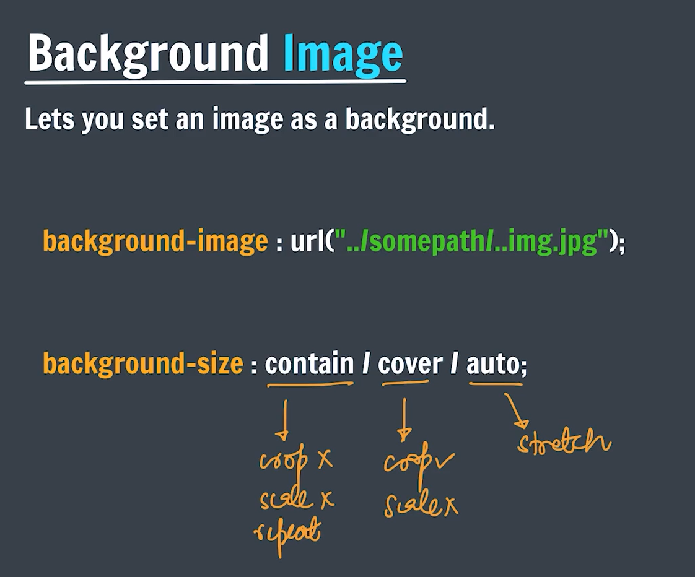


**Position**
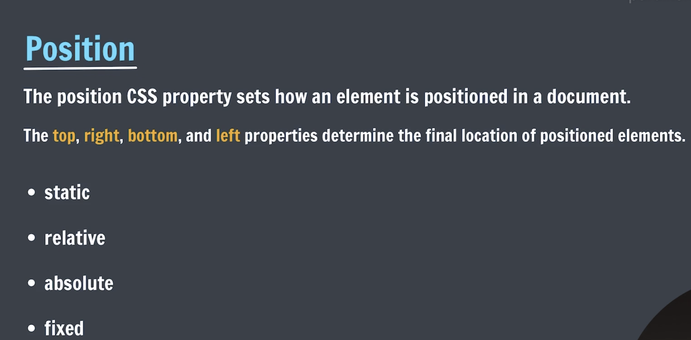

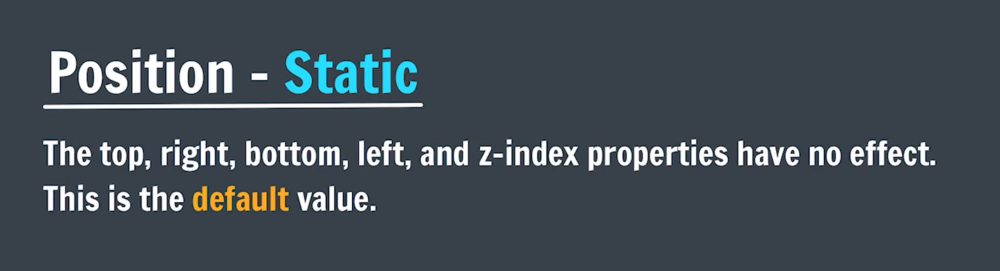
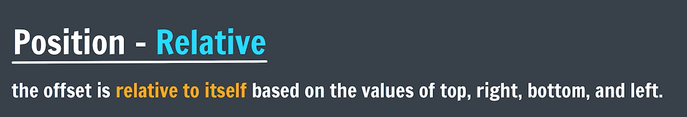

In case of parent whose position is relative or the root element
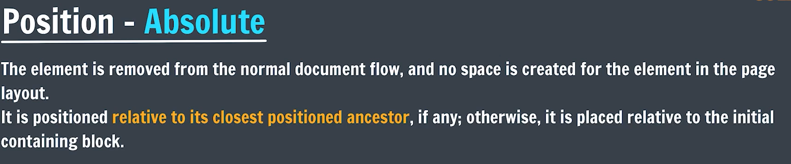